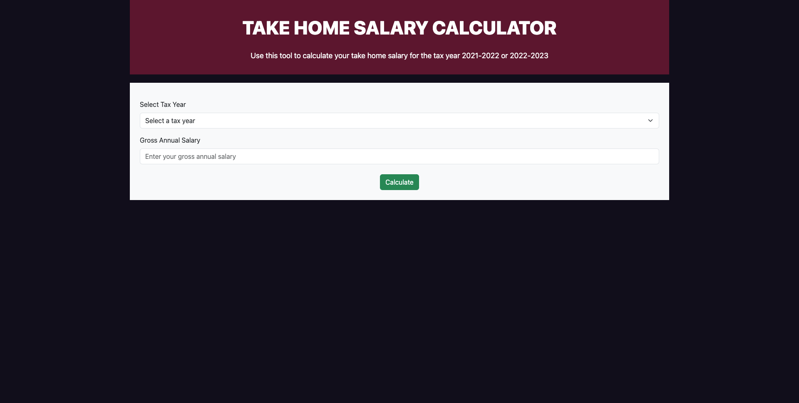
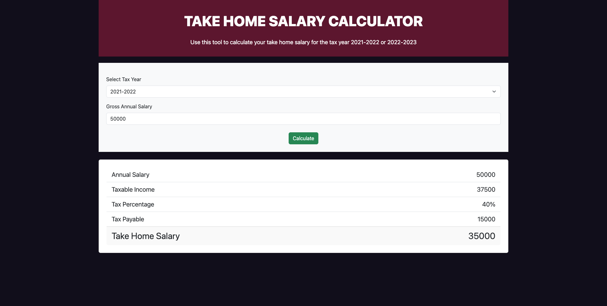
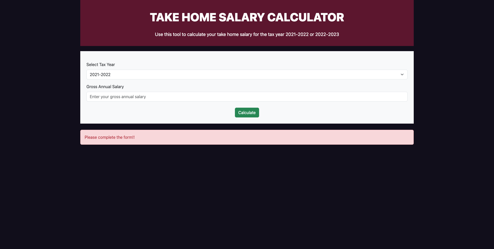

# Take Home Salary Calculator

## User Story

As a user I should be able to determine my take home salary after income tax deduction for the year tax 2021/2022 and also my new income tax deduction for the year 2022/2023 taking in to account the national personal allowance of £12,500.

| Annual Salary      | 21/22 Tax % | 22/23 Tax % |
| ------------------ | ----------- | ----------- |
| £12,501 - £40,000  | 20%         | 18%         |
| £40,001 - £100,000 | 40%         | 35%         |
| above £100,000     | 45%         | 40%         |

**Example for 2021/2022**

> Annual income: £50,000

> Taxable income: £50,000 - £12,500 = £37,500

> Tax %: 40%

> Tax: 40% of £37,500 = £15,000

> Take home salary: £50,000 - £15,000 = **£35,000**

**Example for 2022/2023**

> Annual income: £50,000

> Taxable income: £50,000 - £12,500 = £37,500

> Tax %: 35%

> Tax: 35% of £37,500 = £13,125

> Take home salary: £50,000 - £13,125 = **£36,875**

## Acceptance Criteria

- User should be able to enter their gross salary
- User should be able to select the tax year from a drop-down: 2021/2022 or 2022/2023
- When the user clicks on the "Calculate" button then the results are displayed in a card with the following information:
  - Annual Salary
  - Taxable Income
  - Tax Percentage
  - Taxed Payable
  - Take Home Salary
- When the user clicks on the "Calculate" button without a valid gross salary then an error message must be displayed "Please complete the form!!"

## Technical Criteria

- Use function based components
- Use the react hook `useState`
- Ensure that the code follows semantic HTML structure
- Ensure that the code is well structured in to re-useable components
- Ensure the codebase follows the React files and folder structure
- Deploy the react application using [GitHub pages](https://github.com/gitname/react-gh-pages)

## Additional Resources

- You can use [Bootstrap 5](https://getbootstrap.com/docs/5.3/getting-started/introduction/) as your CSS framework
- You can choose a colour palette from [coolors](https://coolors.co/)
- You can import [font-awesome icons](https://fontawesome.com/icons) using the [CDN](https://cdnjs.com/libraries/font-awesome)

## Wireframe Guide

Please use this high level wireframe as a guide for your portfolio and you are free to choose your own colours and/or layout if needed.

TODO

## Example Application

### Initial Load

### Valid Submission

### Error

